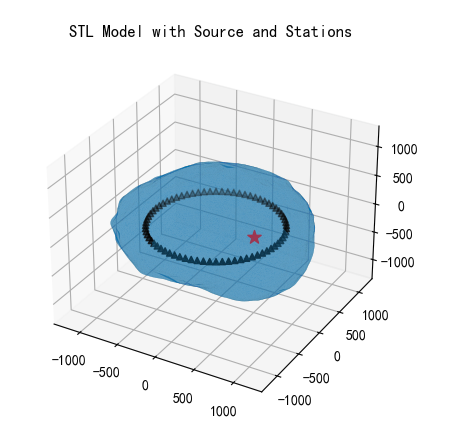
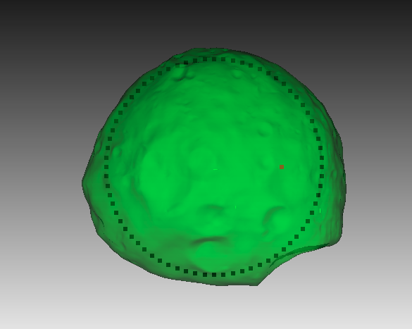
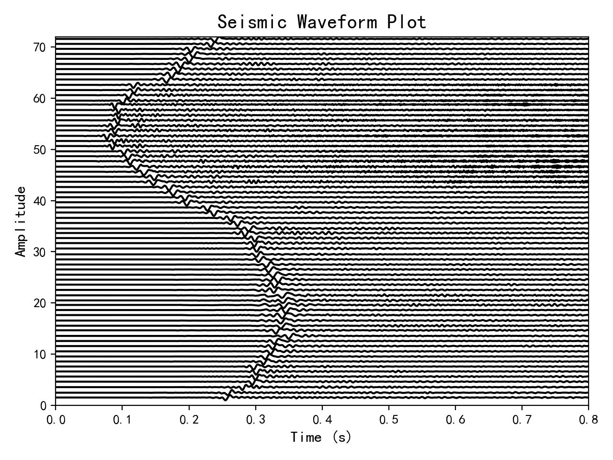
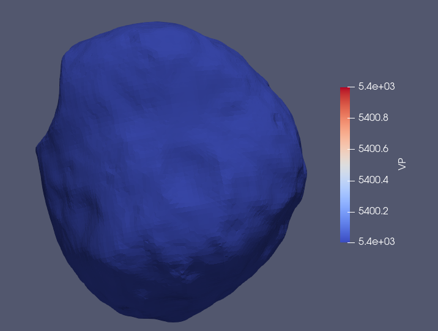
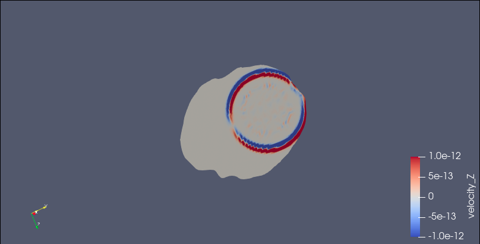

# WFSA 

## Wave Field Simulation of Irregular Asteroids
 * This repository provides a comprehensive workflow for simulating wave fields on irregular asteroids using CUBIT and the Spectral Element Method (SPECFEM).
 * The workflow includes STL file processing, mesh generation, velocity model preparation, source and station setup, parameter file modification, forward modeling, and visualization.

## 一、Installation and Setup

### 1. Software Installation

#### CUBIT

* Download and install CUBIT.
  You can download it from `https://cubit.sandia.gov/downloads/`this website and obtain a trial license for commercial or academic use from `https://coreform.com/account/`
* Set up the CUBIT_PATH in the main program topoint to your CUBIT installation directory. Example:
```python 
CUBIT_PATH = '/path/to/cubit/bin/'
```

#### SPECFEM3D

You can download it from `https://github.com/SPECFEM/specfem3d_globe`this website
* Download and install SPECFEM3D.
* Set up the SPECFEM_PATH in the main program to point to the bin directory of your SPECFEM installation. Example:
```python
SPECFEM_PATH = '/path/to/specfem/bin/'
```
### 2.Create and Activate a Virtual Environment

Assume you have installed the number anaconda
* Create a new Python virtual environment:
```shell
conda create -n asteroid python==3.8
```
* Activate the virtual environment:
```shell
conda activate asteroid
```
* Install the required Python packages:
```shell 
conda  install numpy matplotlib scipy
```

## 二、Prepare Model Files

### 1. STL Model File:

* Place your STL model file in the `./model/*.stl` directory. 
* Adjust the stl_file file name`stl_file` and `scale factor` in the main program accordingly, making sure to adjust the stl model to the size you want.

### 2. Prepare you model mesh size and convert SEM files

* Modify the `mesh_size` parameters in the main program, and run the corresponding program to perform STL model meshing and SPECFEM required file conversion

### 3. Velocity file

* Modify the speed parameters `vp_ma`,`vp_min`,`vs_max`,`vs_min`,`rho`,`gradient` of the stl model and generate an external speed file.
  
### 4. Source and Station Files:

* Modify source and station parameters `source`,`f0`,`M`,`R` to generate source and station files.
  
### 5. Parameter File:

* Change the main program `modifications` parameter to replace the Par_file file parameter you need to modify to generate a new Par_file file.

## 三、 Run the Simulation

* When you have all the files ready, run the main program in the asteroid environment.
```python 
python Workflow.py
```

## 四、Visualization
 * You can view the file by modifying the Visualization section of the main program.
  
  ### 1. STL Files

### 2. Observation System
 * use python
 
 * use cubit
 

### 3.Seismic Waveforms
 
### 4. Wave Field Snapshots and Velocity Files

 * see ParaView to visualize the wave field snapshots and velocity files.\
  
  
  